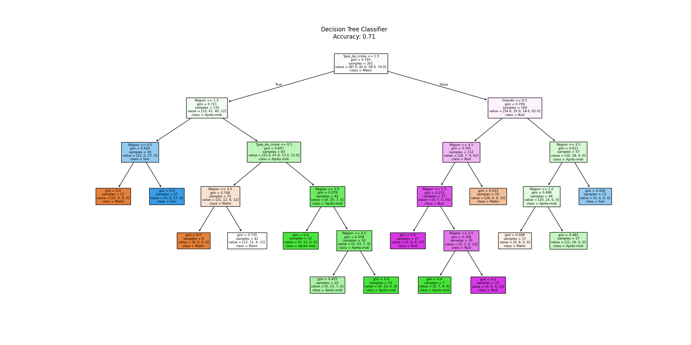

# Classificateur Arbre de Décision pour les Données de Criminalité

Ce projet implémente un classificateur Arbre de Décision pour analyser un jeu de données contenant des informations sur les crimes. Le modèle utilise le type de crime, la région et la gravité pour prédire le moment de la journée où les crimes sont les plus susceptibles de se produire.

## Structure du Projet

- `Crime_clasification_dataset.csv` : Le jeu de données original de criminalité avec des champs tels que `Type_de_crime`, `Région`, `Gravité`, et `Période_de_la_journée`.
- `TP1.py` : Script Python qui encode les données catégorielles, entraîne un modèle d’arbre de décision et visualise l'arbre de décision.

## Caractéristiques

Les caractéristiques suivantes sont utilisées pour entraîner le classificateur d’arbre de décision :
- **Type_de_crime** : Le type de crime (par exemple, "Vol", "Fraude").
- **Région** : La région où le crime a eu lieu (par exemple, "Île-de-France", "PACA").
- **Gravité** : La gravité du crime (par exemple, "Élevée", "Faible").

La variable cible est :
- **Période_de_la_journée** : Le moment de la journée (par exemple, "Matin", "Après-midi", "Soir", "Nuit").

## Prise en Main

### Prérequis

Assurez-vous d'avoir Python installé avec les bibliothèques suivantes :
- `pandas`
- `scikit-learn`
- `matplotlib`

Vous pouvez installer les packages requis avec :
```bash
pip install pandas scikit-learn matplotlib
```

### Utilisation

1. Clonez le dépôt sur votre machine locale.
2. Ajoutez votre jeu de données de criminalité sous le nom `Crime_clasification_dataset.csv` ou modifiez le script pour utiliser vos propres données.
3. Exécutez le script :
   ```bash
   python TP1.py
   ```

### Vue d’Ensemble du Code

Le script effectue les étapes suivantes :
1. **Encodage des Données** : Les caractéristiques catégorielles sont encodées en valeurs numériques pour être compatibles avec le classificateur d'arbre de décision de scikit-learn.
2. **Entraînement du Modèle** : Un modèle de Classificateur Arbre de Décision est entraîné sur les caractéristiques.
3. **Évaluation du Modèle** : La précision du modèle est calculée et affichée.
4. **Visualisation de l'Arbre de Décision** : L’arbre de décision est visualisé, montrant les séparations et l’importance des caractéristiques.

## Résultats

L’arbre de décision fournit des indications sur la façon dont le type de crime, la région et la gravité influencent le moment de la journée où le crime est le plus susceptible de se produire. La précision du modèle est affichée lors de l'exécution, ainsi qu'une visualisation de l'arbre.



